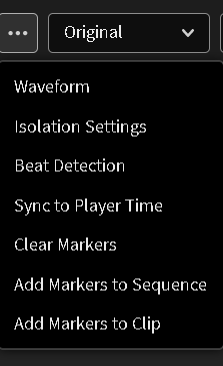
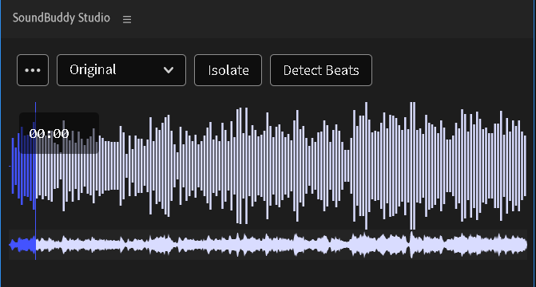
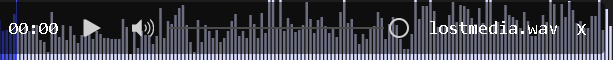
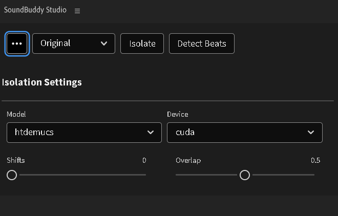
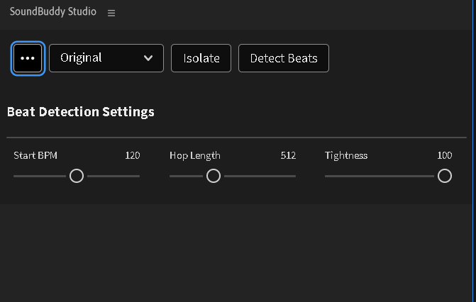
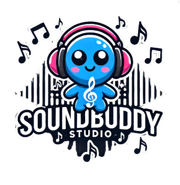

# SoundBuddy Studio CEP Extension

SoundBuddy Studio is a powerful CEP extension for Adobe applications that offers advanced audio isolation, beat detection, SFX asset management, and audio matching features. Whether you're a music video editor or an AMV creator, SoundBuddy Studio provides the tools you need to enhance your audio editing workflow.

## Features

- **Audio Isolation**: Isolate vocals, drums, bass, guitar, piano, and other elements from your audio tracks.
- **Advanced Beat Detection**: Detect beats with customizable settings to sync your audio perfectly.
- **Marker Management**: Add markers to the waveform, your sequence, and your clips easily.
- **Export Options**: Add your isolated clips to the project for further editing.
    ### ***COMING SOON***
- **SFX Asset Management**: Organize and manage your sound effects assets efficiently.
- **Audio Matching**: Find sounds that can sync to music playing for seamless match edits.

## Changelog

- **1.0.0a: Initial Release**
  - **Audio Isolation** via Standard htdemucs, with optional advanced parameters. 
  - **Beat Detection**, with optional advanced parameters.
      - Add Markers to Sequence, or Clip.
      - Remove Markers from project.
  - **Waveform Visualization**: Visualize waveforms, with zoom + scroll functionality. Syncs to PrPro Player time.

## Installation

### CEP Installation

1. Clone the Repo.
2. Place the `CEP` folder into the following directory: `C:\Program Files (x86)\Common Files\Adobe\CEP\extensions`.
3. Open Adobe Premiere and access the extension.

### ZXP Installation

1. Download the ZXP file from the most recent release.
2. Install the ZXP file using [ZXPInstaller](https://aescripts.com/learn/zxp-installer/).

## Usage

### Isolation Options Picker

- The Isolation Options Picker will be disabled until you run an isolation session.
- Always shown at the top of the UI.
- Changing the picker will update what's displayed in the waveform UI.

### Advanced Settings

- Access advanced settings under the action menu tabs.
- Changing advanced settings is optional but available for more control.

### Adding Markers

- Add markers to the waveform, your sequence, and your clips with ease.
- You can also add your isolated clips to the project.

## Screenshots

### Main Interface

### Isolation Settings

### Beat Detection Settings

## License

This project is licensed under the AEGPL 3.0 License.

## Let's Connect

Feel free to reach out for collaborations or just a chat about tech, art, or anything in between!

📫 Email: spigonvids@gmail.com

  
  

